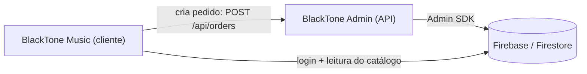
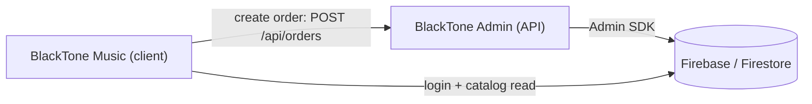

# 🎸 BlackTone Music

> Storefront mobile de um e-commerce musical — Expo + React Native + Firebase.
> Mobile storefront of a music e-commerce — Expo + React Native + Firebase.

**🇧🇷 [Português](#-português) · 🇬🇧 [English](#-english)**
Projeto irmão / companion app: **[BlackTone Admin](https://github.com/ThiagoTzk/blacktone-admin)** (backoffice + API).

---

## 🇧🇷 Português

### Sobre o projeto
BlackTone Music é o aplicativo **da loja** (storefront) de um e-commerce musical: instrumentos, vinis e produtos musicais. Inclui autenticação, catálogo vindo do Firestore, busca, carrinho, checkout, histórico de compras, perfil, endereço por CEP, tema claro/escuro e dois idiomas.

Começou como trabalho de faculdade (prof. **Carlos Alberto Correia Lessa Filho**) e evoluiu para um estudo de e-commerce mais completo. Faz par com o **BlackTone Admin**, o backoffice web que administra o mesmo Firebase.

### O ecossistema BlackTone
Dois apps que compartilham o **mesmo projeto Firebase**:
- **BlackTone Music** (este repo) — o app do cliente (Android, iOS e web via Expo).
- **BlackTone Admin** — o painel + API (Next.js) que administra catálogo, pedidos e usuários.



> 🔒 O pedido **não** é gravado direto pelo app: ele envia apenas os itens (produto + quantidade) e o servidor do Admin **recalcula o total** a partir dos preços reais. Isso impede que o cliente forje o valor.

### Funcionalidades
- Cadastro e login com email/senha (Firebase Auth via REST).
- Catálogo carregado do Cloud Firestore.
- Busca por nome, categoria, descrição e preço.
- Carrinho e checkout (CPF, endereço, forma de pagamento).
- Pagamento simulado (cartão, Pix, débito).
- Criação de pedido com **total recalculado no servidor**.
- Histórico de compras no perfil.
- Endereço padrão com preenchimento automático por CEP (ViaCEP).
- Cartão padrão simplificado (sem número completo nem CVV).
- Foto de perfil pela câmera do dispositivo.
- Tema claro/escuro que segue o sistema (a status bar acompanha).
- Interface em português e inglês.
- Cuidados de acessibilidade (WCAG AA): contraste, labels, hints e área segura.
- Atualizações publicadas via EAS Update.

### Stack
Expo · React Native · React · TypeScript · Expo Router · Context API · Expo Camera · Expo Status Bar · EAS Update · ESLint

### Serviços externos
| Serviço | Uso | Arquivo |
|---|---|---|
| Firebase Authentication (REST) | cadastro e login | `src/config/firebase-config.ts` |
| Cloud Firestore (REST) | catálogo, perfil e leitura de pedidos | `src/services/firestore.ts` |
| BlackTone Admin API | criação de pedidos (`POST /api/orders`) | `src/services/firestore.ts` |
| ViaCEP | endereço a partir do CEP | `src/services/cep.ts` |

### Estrutura
```text
app/
  (tabs)/  index · busca · carrinho · perfil
  login · cadastro · pagamento · dados-conta · historico
  produto/[id]
components/  botões acessíveis, logo, toggle de idioma
src/
  config/   firebase-config
  context/  Carrinho · Language · Produtos · Theme · Usuario
  data/     produto
  services/ cep · firestore
  utils/    preco · firebase-auth-errors
firestore.rules
```

### Configuração e execução
1. Crie um `.env` na raiz (variáveis públicas usam o prefixo `EXPO_PUBLIC_`):
   ```env
   EXPO_PUBLIC_FIREBASE_API_KEY=...
   EXPO_PUBLIC_FIREBASE_AUTH_DOMAIN=...
   EXPO_PUBLIC_FIREBASE_PROJECT_ID=...
   EXPO_PUBLIC_FIREBASE_STORAGE_BUCKET=...
   EXPO_PUBLIC_FIREBASE_MESSAGING_SENDER_ID=...
   EXPO_PUBLIC_FIREBASE_APP_ID=...
   EXPO_PUBLIC_FIREBASE_MEASUREMENT_ID=...
   # URL do BlackTone Admin (cria os pedidos com total no servidor)
   EXPO_PUBLIC_ADMIN_API_URL=https://seu-admin.vercel.app
   ```
2. Instale e rode:
   ```bash
   npm install
   npx expo start   # depois pressione: a (Android) · i (iOS) · w (web)
   ```
> O `.env` **não** deve ir para o GitHub.

### Scripts
| Comando | O que faz |
|---|---|
| `npx expo start` | inicia o app |
| `npm run android` / `ios` / `web` | abre na plataforma |
| `npm run lint` | ESLint |
| `npm run typecheck` | `tsc --noEmit` |

### Segurança (Firestore)
As regras ficam em `firestore.rules` (neste repo):
- **produtos** — leitura pública, escrita só admin.
- **pedidos** — cada usuário lê os próprios; **criação bloqueada no cliente** (feita pelo servidor); atualizar/excluir só admin.
- **usuarios** — cada um lê/edita campos seguros do próprio perfil; admin lista e altera permissões.

### Roadmap
Controle de estoque · cupons de desconto · persistência local da sessão · Firebase Storage para imagens · status de pedido mais completos.

### Desenvolvedor
**Thiago José Camêlo Nunes**

---

## 🇬🇧 English

### About
BlackTone Music is the **storefront** app of a music e-commerce: instruments, vinyl records and music products. It includes authentication, a Firestore-driven catalog, search, cart, checkout, purchase history, profile, ZIP-code address lookup, light/dark theme and two languages.

It started as a college assignment (prof. **Carlos Alberto Correia Lessa Filho**) and grew into a more complete e-commerce study. It pairs with **BlackTone Admin**, the web backoffice that manages the same Firebase project.

### The BlackTone ecosystem
Two apps sharing the **same Firebase project**:
- **BlackTone Music** (this repo) — the customer app (Android, iOS and web via Expo).
- **BlackTone Admin** — the panel + API (Next.js) that manages catalog, orders and users.



> 🔒 The order is **not** written directly by the app: it only sends the items (product + quantity) and the Admin server **recomputes the total** from the real prices, so the client can't forge the amount.

### Features
- Email/password sign up and login (Firebase Auth via REST).
- Catalog loaded from Cloud Firestore.
- Search by name, category, description and price.
- Cart and checkout (CPF, address, payment method).
- Simulated payment (card, Pix, debit).
- Order creation with a **server-recomputed total**.
- Purchase history in the profile.
- Default address with automatic ZIP-code lookup (ViaCEP).
- Simplified default card (no full number or CVV stored).
- Profile photo via the device camera.
- Light/dark theme that follows the OS (status bar included).
- Portuguese and English UI.
- Accessibility care (WCAG AA): contrast, labels, hints and safe area.
- Updates shipped via EAS Update.

### Stack
Expo · React Native · React · TypeScript · Expo Router · Context API · Expo Camera · Expo Status Bar · EAS Update · ESLint

### External services
| Service | Use | File |
|---|---|---|
| Firebase Authentication (REST) | sign up and login | `src/config/firebase-config.ts` |
| Cloud Firestore (REST) | catalog, profile and order reads | `src/services/firestore.ts` |
| BlackTone Admin API | order creation (`POST /api/orders`) | `src/services/firestore.ts` |
| ViaCEP | address from ZIP code | `src/services/cep.ts` |

### Project structure
```text
app/
  (tabs)/  index · busca · carrinho · perfil
  login · cadastro · pagamento · dados-conta · historico
  produto/[id]
components/  accessible buttons, logo, language toggle
src/
  config/   firebase-config
  context/  Carrinho · Language · Produtos · Theme · Usuario
  data/     produto
  services/ cep · firestore
  utils/    preco · firebase-auth-errors
firestore.rules
```

### Setup & run
1. Create a `.env` at the root (public vars use the `EXPO_PUBLIC_` prefix):
   ```env
   EXPO_PUBLIC_FIREBASE_API_KEY=...
   EXPO_PUBLIC_FIREBASE_AUTH_DOMAIN=...
   EXPO_PUBLIC_FIREBASE_PROJECT_ID=...
   EXPO_PUBLIC_FIREBASE_STORAGE_BUCKET=...
   EXPO_PUBLIC_FIREBASE_MESSAGING_SENDER_ID=...
   EXPO_PUBLIC_FIREBASE_APP_ID=...
   EXPO_PUBLIC_FIREBASE_MEASUREMENT_ID=...
   # BlackTone Admin URL (creates orders with the server-side total)
   EXPO_PUBLIC_ADMIN_API_URL=https://your-admin.vercel.app
   ```
2. Install and run:
   ```bash
   npm install
   npx expo start   # then press: a (Android) · i (iOS) · w (web)
   ```
> The `.env` file must **not** be committed.

### Scripts
| Command | What it does |
|---|---|
| `npx expo start` | start the app |
| `npm run android` / `ios` / `web` | open on platform |
| `npm run lint` | ESLint |
| `npm run typecheck` | `tsc --noEmit` |

### Security (Firestore)
Rules live in `firestore.rules` (this repo):
- **produtos** — public read, admin-only writes.
- **pedidos** — each user reads their own; **client creation blocked** (done by the server); update/delete admin-only.
- **usuarios** — each user reads/edits safe fields of their own profile; admin lists and changes permissions.

### Roadmap
Stock control · discount coupons · local session persistence · Firebase Storage for images · richer order statuses.

### Developer
**Thiago José Camêlo Nunes**
